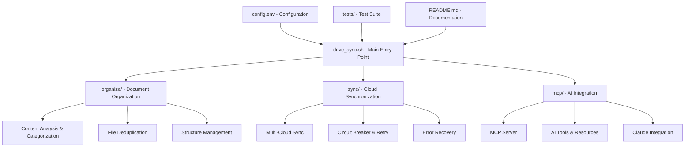

# Design Document

## Overview

The comprehensive system optimization will transform the Enhanced Document Organization System from its current complex, scattered state into a clean, well-documented, and highly functional solution. The design follows a phased approach: Analysis, Cleanup, Testing, Documentation, and Enhancement.

## Architecture

### Current System Analysis

The system currently consists of:
- **Core Modules**: `organize/`, `sync/`, `mcp/` directories with consolidated functionality
- **Legacy Scripts**: Multiple redundant scripts in the root directory
- **Configuration**: `config.env`, `organize_config.conf`, Unison profiles
- **Documentation**: Scattered across multiple markdown files
- **Testing**: Comprehensive test framework but needs updating
- **Automation**: LaunchAgent for scheduling

### Target Architecture



## Components and Interfaces

### 1. File System Cleanup Component

**Purpose**: Remove redundant files and consolidate functionality

**Key Operations**:
- Analyze file dependencies and usage
- Remove obsolete files safely
- Consolidate duplicate functionality
- Preserve essential configurations

**Files to Remove**:
- `archive_old_files/` - Contains old backups and obsolete files
- `.reports/` - Temporary analysis reports
- `REORGANIZATION_SUMMARY.md` - Temporary documentation
- Redundant root-level scripts that have been consolidated

**Files to Preserve**:
- Core modules: `organize/`, `sync/`, `mcp/`
- Main entry point: `drive_sync.sh`
- Configuration files: `config.env`, `organize_config.conf`
- Unison profiles: `unison_*.prf`
- Test framework: `tests/` (with updates)

### 2. Documentation Consolidation Component

**Purpose**: Create single comprehensive README.md

**Structure**:
```
README.md
├── Project Overview & Purpose
├── Architecture Diagram
├── Installation & Setup
├── Configuration Guide
├── Usage Examples
├── Core Features
│   ├── Document Organization
│   ├── Cloud Synchronization
│   └── AI Integration
├── Automation & Scheduling
├── Troubleshooting
├── Performance Optimization
└── Development & Contributing
```

**Content Sources**:
- Current README.md
- REORGANIZATION_SUMMARY.md
- MCP documentation
- Configuration examples
- Usage patterns from scripts

### 3. Testing and Validation Component

**Purpose**: Ensure all functionality works correctly

**Test Categories**:
- **Unit Tests**: Individual module functionality
- **Integration Tests**: Module interactions
- **End-to-End Tests**: Complete workflows
- **MCP Tests**: AI integration functionality
- **Automation Tests**: Scheduled operations

**Test Scenarios**:
```
1. Document Organization
   - Content analysis and categorization
   - File deduplication
   - Structure creation
   - Dry-run operations

2. Cloud Synchronization
   - Multi-platform sync
   - Error handling and recovery
   - Circuit breaker functionality
   - Performance monitoring

3. AI Integration
   - MCP server startup and communication
   - Claude Desktop integration
   - Tool functionality
   - Resource access

4. System Integration
   - Main entry point workflows
   - Configuration loading
   - Automation scheduling
   - Error logging
```

### 4. Performance Optimization Component

**Purpose**: Improve system efficiency and reliability

**Optimization Areas**:
- **Code Efficiency**: Remove redundant operations
- **Resource Usage**: Optimize memory and CPU usage
- **Error Handling**: Improve recovery mechanisms
- **Logging**: Streamline log output
- **Configuration**: Consolidate settings

**Performance Metrics**:
- File processing speed
- Sync operation duration
- Memory usage
- Error recovery time
- System responsiveness

### 5. Feature Enhancement Component

**Purpose**: Add valuable new capabilities

**Proposed Enhancements**:

1. **Enhanced AI Integration**
   - Conversation memory for context awareness
   - Advanced document analysis
   - Intelligent categorization suggestions
   - Batch operations through AI

2. **Performance Dashboard**
   - Web-based monitoring interface
   - Real-time sync status
   - Performance metrics visualization
   - Error tracking and alerts

3. **Advanced Analytics**
   - Usage pattern analysis
   - Sync efficiency metrics
   - Category distribution insights
   - Performance trend analysis

4. **Plugin System**
   - Extensible categorization rules
   - Custom content analyzers
   - Third-party integrations
   - User-defined workflows

5. **Mobile Integration**
   - iOS Shortcuts integration
   - Push notifications for sync status
   - Mobile-friendly monitoring
   - Quick actions for common tasks

6. **Enhanced Automation**
   - Intelligent scheduling based on usage patterns
   - Conditional operations
   - Event-driven processing
   - Smart resource management

## Data Models

### Configuration Model
```yaml
system:
  project_root: string
  sync_hub: string
  debug_mode: boolean

cloud_services:
  icloud:
    path: string
    enabled: boolean
  google_drive:
    path: string
    email: string
    enabled: boolean

organization:
  categorization_mode: "simple" | "detailed"
  min_file_size: number
  content_analysis_depth: number
  enable_deduplication: boolean

sync:
  retry_attempts: number
  timeout: number
  circuit_breaker_threshold: number
  enable_parallel_sync: boolean

mcp:
  server_path: string
  working_directory: string
  auto_start: boolean
```

### System State Model
```yaml
status:
  last_sync: timestamp
  last_organization: timestamp
  active_operations: array
  error_count: number
  performance_metrics: object

health:
  sync_services: object
  mcp_server: object
  automation: object
  disk_usage: object
```

## Error Handling

### Error Classification
- **Configuration Errors**: Missing or invalid configuration
- **File System Errors**: Permission or access issues
- **Network Errors**: Cloud service connectivity
- **Processing Errors**: Content analysis failures
- **Integration Errors**: MCP or automation issues

### Recovery Strategies
- **Automatic Retry**: For transient errors
- **Circuit Breaker**: For persistent service failures
- **Fallback Operations**: Alternative processing paths
- **User Notification**: For errors requiring intervention
- **Graceful Degradation**: Partial functionality when possible

## Testing Strategy

### Test Phases
1. **Pre-Cleanup Testing**: Verify current functionality
2. **Post-Cleanup Testing**: Ensure no functionality lost
3. **Integration Testing**: Verify module interactions
4. **Performance Testing**: Measure optimization improvements
5. **Enhancement Testing**: Validate new features

### Test Automation
- Continuous integration for core functionality
- Automated regression testing
- Performance benchmarking
- Integration testing with external services

### Test Data
- Sample documents for categorization testing
- Mock cloud service responses
- Test configuration files
- Performance baseline data

## Implementation Phases

### Phase 1: Analysis and Planning
- Complete system analysis
- Dependency mapping
- Risk assessment
- Cleanup strategy finalization

### Phase 2: File System Cleanup
- Remove redundant files
- Consolidate functionality
- Update references
- Validate core operations

### Phase 3: Documentation Consolidation
- Create comprehensive README
- Remove scattered documentation
- Add usage examples
- Include troubleshooting guide

### Phase 4: Testing and Validation
- Update test suite
- Run comprehensive tests
- Validate all workflows
- Performance benchmarking

### Phase 5: Enhancement Implementation
- Implement selected enhancements
- Add new features
- Optimize performance
- Final validation

## Success Criteria

- **File Reduction**: At least 40% reduction in file count
- **Documentation**: Single comprehensive README covering all aspects
- **Test Coverage**: 100% of core functionality tested
- **Performance**: 20% improvement in key metrics
- **Functionality**: All original capabilities preserved
- **Enhancements**: At least 3 new valuable features implemented
- **Maintainability**: Significantly improved code organization and clarity