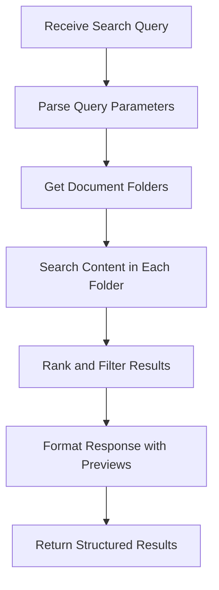
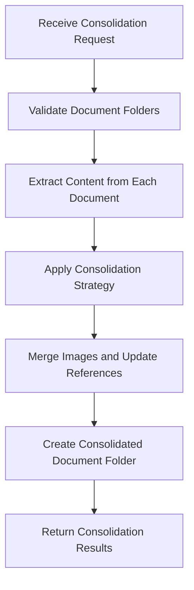
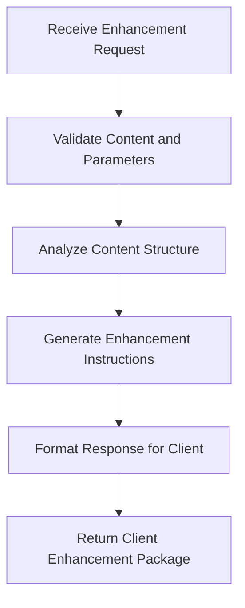

# Design Document

## Overview

This document outlines the design for fixing the MCP server tools that are currently producing inadequate results. The main issues are: consolidate_content only creates folders with links instead of merging content, enhance_content returns null, search_documents returns no results, and other tools fail to perform their core functions. Additionally, the system needs to support a new folder-based document architecture where each document is a folder containing the main file and an images subfolder.

## Architecture

### Core Design Principles

1. **Folder-First Architecture**: All tools must understand that documents are folders containing main files and images
2. **Functional Simplicity**: Replace complex implementations with straightforward, working solutions
3. **Content-Focused Operations**: Tools should work with actual content, not just file metadata
4. **Reliable Path Resolution**: Use simple, predictable path handling instead of complex fallback chains
5. **Client-Server Cooperation**: Enable MCP clients to perform operations that require external resources

### Document Structure Model

```
Category/
├── Document-Name-1/
│   ├── main.md (or document-name.md)
│   └── images/
│       ├── image1.png
│       └── image2.jpg
├── Document-Name-2/
│   ├── main.md
│   └── images/
└── Document-Name-3/
    ├── main.md
    └── images/
```

## Components and Interfaces

### 1. Document Folder Manager

**Purpose**: Central service for handling folder-based document operations.

**Key Features**:
- Document folder detection and validation
- Main document file location within folders
- Images subfolder management
- Atomic folder operations (move, copy, delete)

**Interface**:
```javascript
class DocumentFolderManager {
    constructor(syncHubPath)
    
    // Document folder operations
    isDocumentFolder(folderPath)
    getMainDocumentFile(folderPath)
    getImagesFolder(folderPath)
    createDocumentFolder(name, category)
    moveDocumentFolder(sourcePath, targetPath)
    deleteDocumentFolder(folderPath)
    
    // Content access
    getDocumentContent(folderPath)
    updateDocumentContent(folderPath, content)
    
    // Folder traversal
    listDocumentFolders(categoryPath)
    findDocumentFolders(searchPath, recursive = true)
}
```

### 2. Simplified Search Engine

**Purpose**: Replace shell-command-based search with JavaScript implementation.

**Key Features**:
- Folder-aware document traversal
- Content-based text search
- Metadata extraction and indexing
- Result ranking and filtering

**Interface**:
```javascript
class DocumentSearchEngine {
    constructor(documentFolderManager)
    
    // Search operations
    searchDocuments(query, options = {})
    searchInCategory(query, category, options = {})
    
    // Content analysis
    extractDocumentMetadata(folderPath)
    indexDocumentContent(folderPath)
    
    // Helper methods
    parseSearchQuery(query)
    rankSearchResults(results, query)
    formatSearchResults(results)
}
```

### 3. Content Consolidation Engine

**Purpose**: Actually merge document content instead of just creating links.

**Key Features**:
- Multiple consolidation strategies
- Content merging and organization
- Duplicate content handling
- Structure preservation

**Interface**:
```javascript
class ContentConsolidationEngine {
    constructor(documentFolderManager)
    
    // Consolidation strategies
    simpleMerge(documentFolders, topic)
    structuredConsolidation(documentFolders, topic)
    comprehensiveMerge(documentFolders, topic)
    
    // Content processing
    extractContentSections(documentPath)
    mergeContentSections(sections, strategy)
    createConsolidatedDocument(mergedContent, topic, targetFolder)
    
    // Image handling
    consolidateImages(sourceFolders, targetFolder)
    updateImageReferences(content, imageMap)
}
```

### 4. Enhanced Tool Response Handler

**Purpose**: Standardize tool responses and enable client-side operations.

**Key Features**:
- Consistent response formatting
- Client instruction generation
- Error handling and reporting
- Operation metadata tracking

**Interface**:
```javascript
class ToolResponseHandler {
    constructor()
    
    // Response formatting
    formatSuccessResponse(data, metadata = {})
    formatErrorResponse(error, context = {})
    formatClientInstructionResponse(instruction, data)
    
    // Client-side operation support
    createEnhancementInstruction(content, enhancementType, topic)
    createAnalysisInstruction(content, analysisType)
    
    // Metadata handling
    addOperationMetadata(response, operation, timing)
    addDebugInformation(response, debugData)
}
```

## Data Models

### Document Folder Model

```javascript
{
    folderPath: 'string',           // Full path to document folder
    name: 'string',                 // Document folder name
    category: 'string',             // Parent category
    mainFile: 'string',             // Path to main document file
    imagesFolder: 'string',         // Path to images subfolder
    metadata: {
        created: 'timestamp',
        modified: 'timestamp',
        size: 'number',
        imageCount: 'number'
    }
}
```

### Search Result Model

```javascript
{
    documentFolder: 'DocumentFolderModel',
    relevanceScore: 'number',
    matchedContent: [{
        section: 'string',
        excerpt: 'string',
        lineNumber: 'number'
    }],
    preview: 'string',
    highlightedPreview: 'string'
}
```

### Consolidation Result Model

```javascript
{
    success: 'boolean',
    consolidatedFolder: 'string',
    strategy: 'string',
    sourceDocuments: ['string'],
    mergedContent: 'string',
    imagesMerged: 'number',
    metadata: {
        totalSections: 'number',
        duplicatesRemoved: 'number',
        processingTime: 'number'
    }
}
```

## Tool Implementation Designs

### 1. search_documents Tool

**Current Problem**: Returns no results for any query
**Root Cause**: Shell command failures and complex path resolution
**Solution**: 
- Use DocumentSearchEngine with folder-aware traversal
- Implement JavaScript-based text search
- Return structured results with content previews

**Implementation Flow**:


### 2. consolidate_content Tool

**Current Problem**: Only creates folders with links instead of merging content
**Root Cause**: ContentConsolidator not actually consolidating content
**Solution**:
- Implement actual content merging logic
- Support different consolidation strategies
- Create unified documents with proper structure

**Implementation Flow**:


### 3. enhance_content Tool

**Current Problem**: Returns null instead of enabling client-side enhancement
**Root Cause**: Trying to do AI enhancement server-side without AI capabilities
**Solution**:
- Return content in format suitable for client-side enhancement
- Provide enhancement instructions and context
- Enable MCP client to perform the actual enhancement

**Implementation Flow**:


### 4. Document Management Tools

**Current Problem**: Don't handle folder-based structure properly
**Solution**:
- Use DocumentFolderManager for all operations
- Ensure atomic folder operations
- Preserve image references and folder integrity

## Error Handling Strategy

### 1. Graceful Degradation
- Tools continue working with reduced functionality when modules fail
- Provide partial results when complete operations fail
- Clear error messages with specific remediation steps

### 2. Debug Information
- Include search paths and attempted operations in error responses
- Provide file system state information for troubleshooting
- Log detailed error context for developer debugging

### 3. Client Guidance
- Return specific instructions for client-side operations
- Provide alternative approaches when server-side operations fail
- Include system status information in error responses

## Performance Considerations

### 1. Efficient Folder Traversal
- Cache document folder locations
- Use streaming for large content operations
- Implement pagination for large result sets

### 2. Content Processing Optimization
- Process documents in batches
- Use streaming for large file operations
- Implement timeout handling for long operations

### 3. Memory Management
- Stream large content instead of loading entirely into memory
- Clean up temporary files and resources
- Implement resource limits for batch operations

## Testing Strategy

### 1. Folder Structure Testing
- Test with various document folder configurations
- Verify image folder handling and preservation
- Test atomic folder operations

### 2. Content Operation Testing
- Test search with various query types and content
- Test consolidation with different document types and sizes
- Test enhancement instruction generation

### 3. Error Condition Testing
- Test with missing files and folders
- Test with corrupted or inaccessible content
- Test with invalid parameters and edge cases

## Migration Strategy

### 1. Backward Compatibility
- Support both old file-based and new folder-based structures during transition
- Provide migration tools to convert existing documents to folder structure
- Maintain existing API contracts while improving functionality

### 2. Incremental Rollout
- Fix tools one at a time to minimize disruption
- Test each tool thoroughly before moving to the next
- Provide rollback capability for each tool fix

### 3. Documentation and Training
- Update tool documentation with new folder-based examples
- Provide migration guides for existing users
- Create troubleshooting guides for common issues