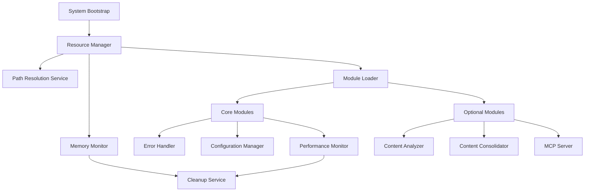
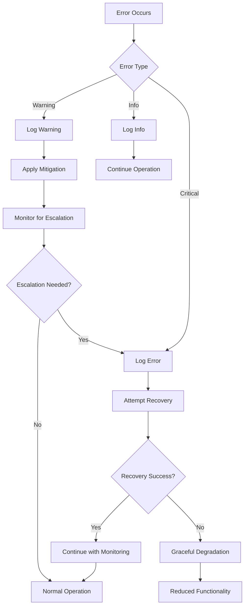

# Design Document

## Overview

This document outlines the design for optimizing the Enhanced Document Organization System's performance and reliability. The design focuses on addressing the critical memory usage issue (currently at 98.2%) and implementing systematic optimizations across all system components while maintaining the existing 96.9% validation success rate.

## Architecture

### Core Design Principles

1. **Memory-First Optimization**: All design decisions prioritize memory efficiency
2. **Lazy Loading**: Load components only when needed
3. **Resource Pooling**: Reuse expensive resources like file handles and network connections
4. **Graceful Degradation**: System continues operating even when individual components fail
5. **Observable Performance**: All operations are monitored and measurable

### System Architecture Overview



## Components and Interfaces

### 1. Resource Manager

**Purpose**: Central coordinator for all system resources including memory, file handles, and processing threads.

**Key Features**:
- Memory usage tracking and optimization
- File handle pooling and cleanup
- Process lifecycle management
- Resource limit enforcement

**Interface**:
```javascript
class ResourceManager {
    constructor(options = {})
    async initialize()
    async allocateMemory(size, purpose)
    async releaseMemory(allocation)
    async getFileHandle(path, mode)
    async releaseFileHandle(handle)
    getMemoryUsage()
    enforceMemoryLimits()
    cleanup()
}
```

### 2. Path Resolution Service

**Purpose**: Centralized, validated path management for all system components.

**Key Features**:
- Single source of truth for all paths
- Environment variable expansion
- Path validation and normalization
- Cross-platform compatibility

**Interface**:
```javascript
class PathResolutionService {
    constructor(projectRoot, config)
    async initialize()
    resolvePath(pathKey)
    validatePath(path)
    normalizePath(path)
    getProjectRoot()
    getSyncHub()
    getConfigPath()
    expandEnvironmentVariables(path)
}
```

### 3. Memory Monitor

**Purpose**: Continuous monitoring and optimization of system memory usage.

**Key Features**:
- Real-time memory tracking
- Automatic garbage collection triggers
- Memory leak detection
- Performance alerts

**Interface**:
```javascript
class MemoryMonitor {
    constructor(thresholds = {})
    start()
    stop()
    getCurrentUsage()
    getUsageHistory()
    triggerCleanup()
    detectLeaks()
    onMemoryWarning(callback)
    onMemoryError(callback)
}
```

### 4. Optimized Module Loader

**Purpose**: Efficient, on-demand loading of system modules with dependency management.

**Key Features**:
- Lazy loading with caching
- Dependency resolution
- Circular dependency detection
- Module health monitoring

**Interface**:
```javascript
class OptimizedModuleLoader {
    constructor(resourceManager, pathService)
    async loadModule(moduleName, options = {})
    async unloadModule(moduleName)
    isModuleLoaded(moduleName)
    getLoadedModules()
    resolveDependencies(moduleName)
    detectCircularDependencies()
}
```

### 5. Performance Monitor

**Purpose**: Comprehensive performance tracking and optimization recommendations.

**Key Features**:
- Operation timing and profiling
- Resource usage analytics
- Performance bottleneck identification
- Optimization suggestions

**Interface**:
```javascript
class PerformanceMonitor {
    constructor(resourceManager)
    startOperation(operationName)
    endOperation(operationName)
    recordMetric(name, value, tags = {})
    getPerformanceReport()
    getOptimizationSuggestions()
    onPerformanceAlert(callback)
}
```

## Data Models

### Resource Allocation Model

```javascript
{
    id: 'string',
    type: 'memory|file|process',
    size: 'number',
    purpose: 'string',
    allocatedAt: 'timestamp',
    lastAccessed: 'timestamp',
    isActive: 'boolean'
}
```

### Performance Metric Model

```javascript
{
    name: 'string',
    value: 'number',
    unit: 'string',
    timestamp: 'timestamp',
    tags: 'object',
    threshold: 'number',
    status: 'normal|warning|critical'
}
```

### Path Configuration Model

```javascript
{
    key: 'string',
    rawPath: 'string',
    resolvedPath: 'string',
    isValid: 'boolean',
    lastValidated: 'timestamp',
    permissions: ['read', 'write', 'execute']
}
```

## Error Handling

### Enhanced Error Handling Strategy

1. **Layered Error Handling**:
   - Component-level error handling with recovery
   - System-level error aggregation and reporting
   - User-facing error messages with actionable guidance

2. **Error Classification**:
   - **Critical**: System cannot continue (memory exhaustion, missing core files)
   - **Warning**: Degraded functionality (high memory usage, slow operations)
   - **Info**: Operational notices (module loaded, cleanup completed)

3. **Recovery Strategies**:
   - **Memory Issues**: Trigger garbage collection, unload optional modules
   - **File Issues**: Retry with exponential backoff, suggest file system fixes
   - **Module Issues**: Continue with reduced functionality, log for later resolution

### Error Handling Flow



## Testing Strategy

### Performance Testing

1. **Memory Load Testing**:
   - Process large files to test memory management
   - Simulate concurrent operations
   - Test memory cleanup after operations

2. **Path Resolution Testing**:
   - Test path resolution across different environments
   - Validate path normalization and expansion
   - Test error handling for invalid paths

3. **Module Loading Testing**:
   - Test lazy loading performance
   - Validate dependency resolution
   - Test module unloading and cleanup

### Integration Testing

1. **End-to-End Performance Testing**:
   - Full workflow execution with performance monitoring
   - Resource usage validation throughout operations
   - Error handling validation under stress conditions

2. **Resource Management Testing**:
   - File handle leak detection
   - Memory leak detection over extended operations
   - Cleanup validation after system shutdown

### Monitoring and Alerting

1. **Real-time Monitoring**:
   - Memory usage alerts at 70% and 80% thresholds
   - Performance degradation alerts
   - Resource leak detection alerts

2. **Performance Reporting**:
   - Daily performance summaries
   - Optimization recommendation reports
   - Resource usage trend analysis

## Implementation Phases

### Phase 1: Core Infrastructure (Critical)
- Implement ResourceManager with memory monitoring
- Create PathResolutionService for centralized path management
- Implement MemoryMonitor with automatic cleanup triggers

### Phase 2: Module Optimization (High Priority)
- Implement OptimizedModuleLoader with lazy loading
- Refactor existing modules to use ResourceManager
- Implement enhanced error handling patterns

### Phase 3: Performance Monitoring (Medium Priority)
- Implement PerformanceMonitor with metrics collection
- Add performance alerting and reporting
- Implement optimization recommendation engine

### Phase 4: Advanced Features (Low Priority)
- Implement predictive resource management
- Add advanced performance analytics
- Implement automated optimization suggestions

## Success Metrics

1. **Memory Usage**: Reduce from 98.2% to below 70%
2. **System Stability**: Maintain 99%+ uptime during operations
3. **Performance**: Improve operation speeds by 25%
4. **Resource Efficiency**: Reduce file handle and memory leaks to zero
5. **Error Recovery**: Achieve 95% successful error recovery rate